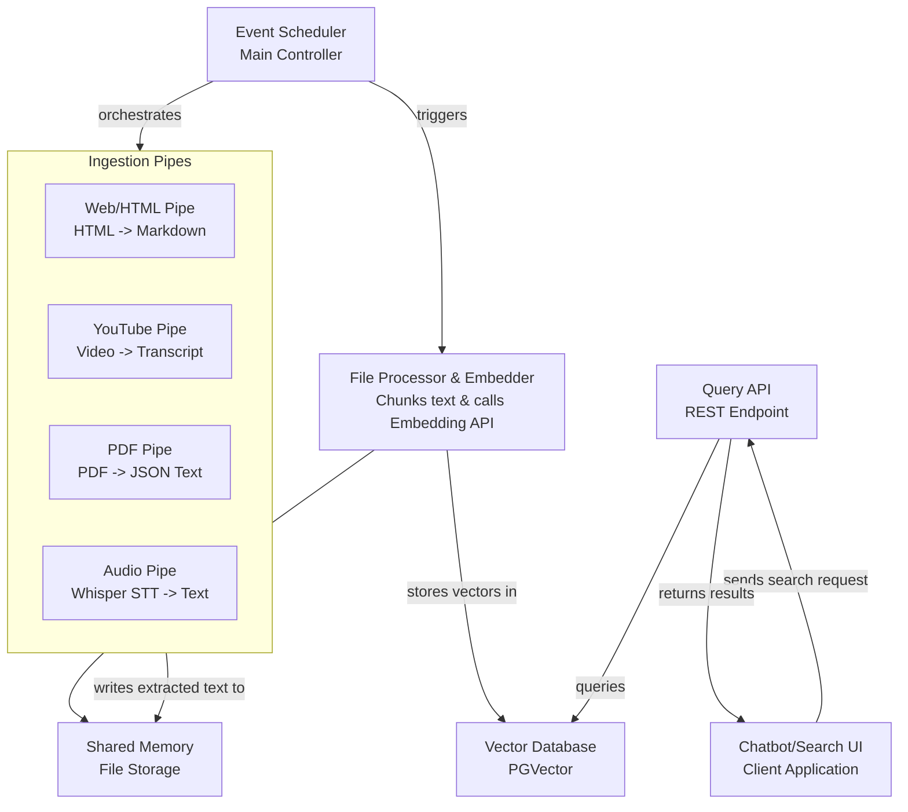
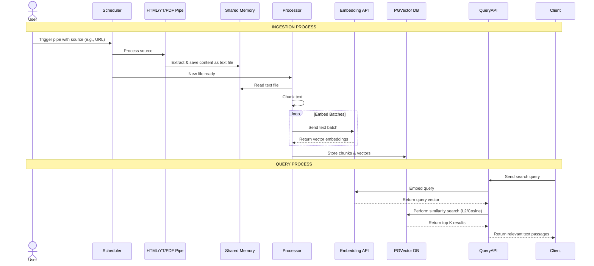

# **PolyglotRAG - A Multi-Source Personal Knowledge Retrieval Engine**

PolyglotRAG is a high-performance, locally-run Retrieval-Augmented Generation (RAG) engine designed to unify and make searchable a wide array of personal knowledge sources. It ingests information from disparate formats (websites, videos, PDFs), processes them into a standardized format, and creates a semantically searchable vector database. The system is built in Rust for efficiency, scalability, and extensibility to serve as the core infrastructure for future AI-powered applications.

#### **Architectural Overview**

The system follows a modular, pipeline-based architecture centered around an event scheduler, allowing for easy integration of new data sources ("pipes") and processing logic.

**High-Level System Architecture:**

This diagram shows the main components and how data flows between them.

**Detailed Data Flow Sequence:**

This sequence diagram details the step-by-step process for ingesting and querying data.

#### **Key Components & Technologies**

*   **Language:** Rust (for performance and memory safety)
*   **Data Sources:** HTML (via `html2md`), YouTube Transcripts, PDFs (text extraction), Audio (OpenAI Whisper)
*   **Concurrency:** Multi-threading, System Channels, and Shared Memory for inter-process communication.
*   **Database:** PostgreSQL with PGVector extension for efficient vector similarity search.
*   **Embeddings:** External API calls to state-of-the-art language models (e.g., OpenAI, Hugging Face).
*   **API:** RESTful API (built with Axum/Actix-web) to handle search queries.

#### **Purpose & Value**

This project solves the "fragmented knowledge" problem. Instead of having information siloed in browser bookmarks, YouTube history, and folders of PDFs, PolyglotRAG creates a unified, semantic search index across all of it. This allows for powerful queries like "find me concepts related to neural attention mechanisms from all my saved articles, videos, and textbooks."
